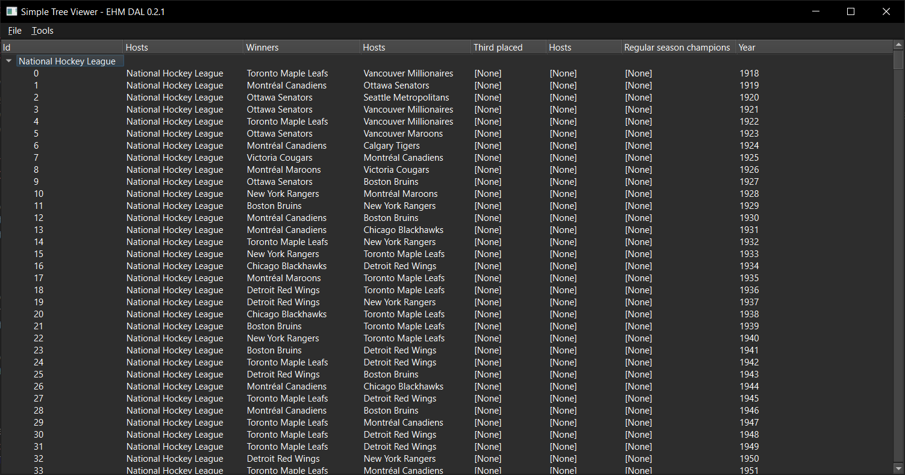

# EHM DAL: Example 01.02 - Simple Tree View
The purpose of this example is to show how easily data from either a database or a saved game's database can be shown using QTreeView and exported to csv/xslx spreadsheets. This project is identical to `Example 01-01` except that we're using a QTreeView here for tree tables rather than QTableView for standard two dimensional tables.

## How to compile the project
Please see the installation guide here: https://github.com/archibalduk/EHM_DAL/blob/main/examples/README.md

## Author
[@archibalduk](https://www.github.com/archibalduk)

## Credits
EHM DAL uses [QXlsx by j2doll](https://github.com/QtExcel/QXlsx). QXlsx is licensed under the MIT license.

## License
[GNU General Public License v3.0](https://choosealicense.com/licenses/gpl-3.0/)
